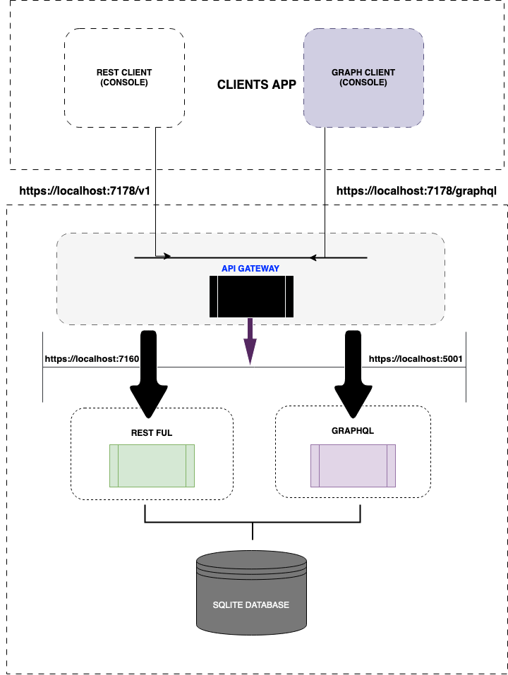

  

 

  
 

  

  

 
# APIWEB

Welcome on the APIWEB project!  

  

_Generated with a_ **Code#0** _template_  
   
# ARCHITECTURE
  

# POURQUOI REST ET GRAPHQL?
** GRAPH QL

    GraphQL est un langage de requête pour les API qui permet aux clients de demander les données qu'ils ont besoin et rien de plus. Il offre plusieurs avantages par rapport aux API REST traditionnelles, notamment :

    Interrogation de données plus flexible : Avec GraphQL, les clients peuvent définir exactement les données qu'ils souhaitent recevoir, sans avoir à accéder à des informations supplémentaires.

    Réduction du nombre de requêtes : En utilisant GraphQL, les clients peuvent effectuer une seule requête pour récupérer toutes les données nécessaires, au lieu de faire plusieurs requêtes à différentes URL REST.

    Amélioration de la performance : Les clients peuvent minimiser le nombre de requêtes en demandant uniquement les données dont ils ont besoin. Cela peut améliorer les performances et la vitesse de l'application.

    Facilité d'évolution : Avec GraphQL, les clients peuvent demander des données supplémentaires ou différentes sans affecter les autres applications qui utilisent les mêmes API.

En utilisant GraphQL pour les produits et les stocks, vous pourriez faciliter la consommation de vos données par les clients en leur donnant un contrôle plus granulaire sur les données qu'ils souhaitent récupérer. De plus, vous pourriez améliorer les performances de l'application en réduisant le nombre de requêtes nécessaires pour obtenir les données, ce qui pourrait améliorer l'expérience utilisateur.
** RESTFUL
ESTful API est un style d'architecture qui est souvent choisi pour les systèmes de gestion de produits et de stocks en raison de plusieurs avantages:

    Simplicité: RESTful est très simple à comprendre et à mettre en œuvre pour les développeurs. Les règles sont claires et les méthodes HTTP standard telles que GET, POST, PUT et DELETE sont faciles à comprendre.

    Flexibilité: RESTful permet aux développeurs de définir les ressources souhaitées pour leurs produits et stocks et de les requêter en conséquence.

    Interopérabilité: RESTful est largement adopté et est donc très compatible avec de nombreux systèmes et technologies.

    Scalabilité: RESTful est très facile à échelle en fonction de la demande.

    Performance: Les performances RESTful sont souvent très bonnes car elles reposent sur des protocoles standard tels que HTTP, ce qui facilite le traitement et la transmission des données.

En résumé, RESTful est une option très viable pour les systèmes de gestion de produits et de stocks en raison de sa simplicité, de sa flexibilité, de son interopérabilité, de sa scalabilité et de ses performances.
**APIGATEWAY

Un "API Gateway" est un pattern d'architecture qui permet de centraliser la gestion des API d'une application. Il agit comme une passerelle entre les applications clientes et les services back-end, fournissant une interface unique pour les clients d'interagir avec les différents services. Les avantages d'utiliser un API Gateway incluent :

    Abstraction des services back-end: Les services back-end peuvent être modifiés ou remplacés sans affecter les applications clientes, car le gateway les abstrait.

    Authentification et autorisation: Le gateway peut être configuré pour gérer l'authentification et l'autorisation des utilisateurs, ce qui peut faciliter la gestion de la sécurité.

    Load balancing: Le gateway peut être configuré pour répartir les requêtes entre plusieurs instances d'un même service, ce qui peut améliorer la disponibilité et les performances

# CONTROLEUR
## PRODUCTS
Ce code représente un contrôleur de l'API Swagger pour une application de gestion de produits. Il comporte les méthodes courantes pour gérer les produits, telles que la récupération de tous les produits (GetAll), la récupération d'un produit par identifiant (GetById), la création d'un nouveau produit (Create), la mise à jour d'un produit existant (Update) et la suppression d'un produit (Delete).

La méthode GetAll prend en entrée les paramètres facultatifs page et taille, qui permettent de paginer les résultats. Elle utilise le service de produit pour récupérer la liste complète de produits et renvoie ensuite une réponse OK avec les données de la page demandée.

La méthode GetById récupère un produit en fonction de son identifiant et renvoie une réponse OK si le produit existe, ou une réponse NotFound si le produit n'a pas été trouvé.

La méthode Create utilise l'objet ProductDTO en entrée pour créer un nouveau produit et renvoie une réponse CreatedAtAction avec les informations sur le nouveau produit.

La méthode Update prend en entrée l'identifiant du produit à mettre à jour ainsi que les nouvelles informations sur le produit. Si le produit n'existe pas, elle renvoie une réponse NotFound, sinon elle utilise le service de produit pour effectuer la mise à jour et renvoie une réponse NoContent.

Enfin, la méthode Delete prend en entrée l'identifiant du produit à supprimer. Si le produit n'existe pas, elle renvoie une réponse NotFound, sinon elle utilise le service de produit pour effectuer la suppression et renvoie une réponse NoContent.

## STOCKS
    La méthode Index avec l'attribut [HttpGet] renvoie tous les stocks en utilisant le service _stockService avec la méthode GetAll(). Le résultat est retourné en utilisant la méthode Ok(stock).

    La méthode GetById avec l'attribut [HttpGet("{id}")] renvoie un stock spécifique en utilisant l'ID en tant que paramètre. Si le stock n'est pas trouvé, la méthode NotFound() est renvoyée. Sinon, le résultat est retourné en utilisant la méthode Ok(stock).

    La méthode Create avec l'attribut [HttpPost] permet de créer un nouveau stock en utilisant les données du corps de la requête envoyée sous forme de StockDTO. La méthode CreatedAtAction(nameof(GetById), new { id = stock.Id }, stock) est utilisée pour renvoyer un code de statut 201 (Créé) avec les informations sur le nouveau stock.

    La méthode Update avec l'attribut [HttpPut("{id}")] permet de mettre à jour un stock existant en utilisant les données du corps de la requête envoyée sous forme de StockDTO et l'ID du stock à mettre à jour en tant que paramètre. Si le stock n'est pas trouvé, la méthode NotFound() est renvoyée. Sinon, la méthode NoContent() est renvoyée pour indiquer que la mise à jour s'est correctement déroulée.

    La méthode Delete avec l'attribut [HttpDelete("{id}")] permet de supprimer un stock existant en utilisant l'ID du stock à supprimer en tant que paramètre. Si le stock n'est pas trouvé, la méthode NotFound() est renvoyée. Sinon, la méthode NoContent() est renvoyée pour indiquer que la suppression s'est correctement déroulée.
